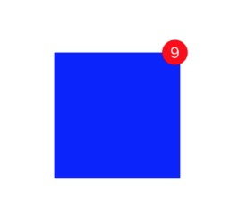
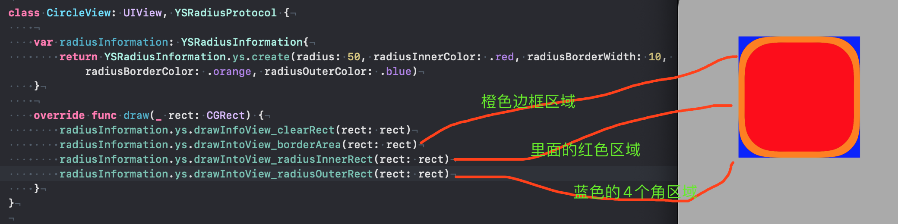
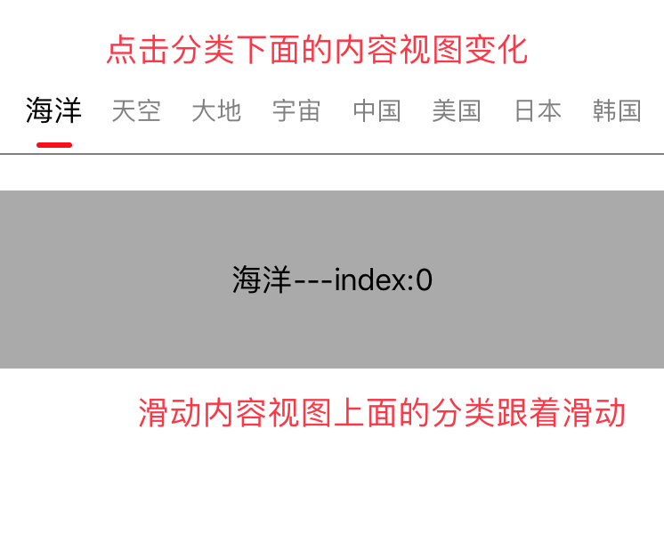

# 自定义导航控制器YSNavC
我们提供的自定义导航器YSNavC具备功能：

1. 隐藏系统导航条
2. 使用自定义的导航条，有侧滑返回手势(可选)
~~~swift
/// 创建自定义导航控制器，设置是否允许侧滑手势和rootVC
let navc = YSNavC.ys.create(allowNavEdgeGesture: true, rootVC: ViewController())

class ViewController: YSBaseVC {
    
    /// 创建自定义导航条
    private lazy var navV:YSNavBar = YSNavBar.ys.create()
    
    override func viewDidLoad() {
        super.viewDidLoad()
        view.backgroundColor = .white
        
        // 直接添加到view上，x,y默认是0，width,height内部写好了
        // 所有这里无需布局
        view.addSubview(navV)
        
        /// 设置导航条
        navV.ys.setupXXXX
    }
}
~~~

# YSTextView(高度随内容而变化的TextView)

场景：我们需要一个TextView，最小高度为70，最大高度为100。当高度 <= 100时，不允许滑动，当高度 > 100，可以滑动。比如：聊天时的输入框。

我们的自定义的YSTextView可以满足此需求。

使用步骤：

1. 创建对象，YSTextView.ys.create
2. 设置最小最大高度 obj.ys.setHeight，注意，这里的最小高度要和设置约束时的高度一致
3. 设置内容高度变化的回调， obj.ys.setHeightChangedCallback

示例代码(这里使用snapkit布局，frame布局一样，只是写法不同而已)
~~~ swift
class ViewController: UIViewController {
    
    private lazy var textV:YSTextView = YSTextView.ys.create().ys.then{
        $0.backgroundColor = .lightGray
        $0.textColor = .black
        $0.font = UIFont.systemFont(ofSize: 15)
        $0.ys.setPlaceHolder(placeHolder: "请输入内容", textColor: .darkGray)
        
        /// 这里的min要和设置的约束的高度一致
        $0.ys.setHeight(min: 70, max: 100)
        
        /// 设置内容高度变化的回调
        $0.ys.setHeightChangedCallback(complete: { [weak self] (textVHeight) in
            self?.textVHeightChanged(height: textVHeight)
        })
    }
    
    override func viewDidLoad() {
        super.viewDidLoad()
        view.backgroundColor = .white
        
        view.addSubview(textV)
        textV.snp.makeConstraints { (make) in
            make.top.equalTo(100)
            make.leading.equalTo(100)
            make.trailing.equalTo(-100)
            /// 约束的高度要和设置的minHeight一致
            make.height.equalTo(70)
        }
    }
    
    /// textView内容变化后的回调执行的方法
    private func textVHeightChanged(height: CGFloat){
        textV.snp.updateConstraints { (make) in
            // 修改TextView的高度为变化后的高低
            make.height.equalTo(height)
        }
        UIView.animate(withDuration: 0.25, animations: {
            self.view.layoutIfNeeded()
        })
    }
}
~~~

# 自定义角标
不解释了，直接上图吧(右上角是badge)：

使用方法：
~~~ swift
/// 设置badge的值
view.ys.badge(value: "9")

/// 设置badge为小红点
view.ys.badge(value: " ")

/// 清除(隐藏)badge
view.ys.badge(value: "")
        
/// 设置badge的值并设置样式
view.ys.badge(value: "9", font: <#T##UIFont?#>, textColor: <#T##UIColor?#>, badgeColor: <#T##UIColor?#>, borderColor: <#T##UIColor?#>, borderWidth: <#T##CGFloat?#>, minDiameter: <#T##CGFloat?#>, horizontalOffset: <#T##CGFloat?#>, verticalOffset: <#T##CGFloat?#>, innerSpaceFromBorder: <#T##CGFloat?#>, position: <#T##YSBadgePosition?#>)
~~~

# 自定义消息提醒小红点

与YSBadgeView的区别：YSBadgeView较大，因为要显示文字；YSRedPointView较小，只显示小红点即可。

使用方法：
~~~ swift
blueV.frame = CGRect(x: 100, y: 100, width: 40, height: 40)
view.addSubview(blueV)
        
/// 显示小红点
blueV.ys.redPoint(show: true)
        
/// 显示小红点并设置小红点的样式
blueV.ys.redPoint(show: true, badgeColor: .orange, borderColor: .green, borderWidth: 2, minDiameter: 30, horizontalOffset: 10, verticalOffset: 10)
~~~

# 圆形背景绘制

场景：有一个View，我们想对他切圆角。那么我们可以使用drawRect的方式进行背景的绘制，绘制出我们想要的圆形，这样方便简单还没离屏渲染。

我们提供了绘制的方法，使用步骤：
1. 创建自定义View，遵守YSRadiusProtocol协议
2. 提供一个协议属性：radiusInformation
3. 使用我们提供的方法进行绘制，比较简单，我们来看图

# CategoryView(自定义分类视图)

我们直接上图，更容易理解这个控件的作用。

- 重点API说明
~~~swift
// 创建，如果传入内容SV，会监听内容SV的滚动，滚动时有缩放效果，否则没有

// 样式设置，具体样式可以点击头文件查看，每个样式都有注释
let style = YSCategoryViewStyle()
style.identifyerLineSize.width = 0 // 为0表示标识线宽度跟随条目走
style.identifierLineAnimationType = .translation // 平移动画
style.identifierLineAnimationType = .stretch // 拉伸动画

let titleList = ["萝卜", "白菜", "大蒜"]

let categoryV = YSCategoryView.ys.create(titleList: titleList, style: style, contentSV: self.cv)
categoryV.addTarget(self, action: #selector(categoryVValueChanged(v:)), for: .valueChanged)

// 当前索引
let a = categoryV.ys.currentIndex
let b = categoryV.ys.currentTitle
        
// 设置选中索引
categoryV.ys.setCurrentIndex(index: 1)
categoryV.ys.setCurrentIndex(title: "")
        
// 重置
categoryV.ys.resetTitles(titleList: ["中国", "美国", "英国"])
        
// 释放相关联的scrollView
categoryV.ys.releaseContentSV()
        
// 在viewDidAppear或viewDidLayoutSubviews中调用
// 适配国际化语音，主要是适配languageRTL
// languageLTR适配不适配都可以
// languageRTL适配了滚动至第一项(最右边)
categoryV.ys.adapterLanguage()
~~~

- Demo，拷贝过去直接运行即可
~~~swift
class FL:UICollectionViewFlowLayout{
    
    override func prepare() {
        super.prepare()
        scrollDirection = .horizontal
        itemSize = CGSize(width: UIScreen.main.bounds.width, height: 100)
        minimumLineSpacing = 0
        minimumInteritemSpacing = 0
    }
}

class Cell: UICollectionViewCell {
    
    private lazy var titleLbl:UILabel = UILabel()
    
    override init(frame: CGRect) {
        super.init(frame: frame)
        backgroundColor = UIColor.lightGray
        setupUI()
    }
    
    required init?(coder aDecoder: NSCoder) {
        fatalError("init(coder:) has not been implemented")
    }
    
    private func setupUI(){
        contentView.addSubview(titleLbl)
        titleLbl.translatesAutoresizingMaskIntoConstraints = false
        contentView.addConstraint(NSLayoutConstraint(item: titleLbl, attribute: .centerX, relatedBy: .equal, toItem: contentView, attribute: .centerX, multiplier: 1, constant: 0))
        contentView.addConstraint(NSLayoutConstraint(item: titleLbl, attribute: .centerY, relatedBy: .equal, toItem: contentView, attribute: .centerY, multiplier: 1, constant: 0))
    }
    
    func setupData(index:Int,text:String){
        titleLbl.text = "\(text)---index:\(index)"
    }
}

class ViewController: UIViewController {
    
    private lazy var titleList = ["天空天空天空","海洋","大地","宇宙","中国","美国","日本","韩国","朝鲜","泰国","西瓜","桃子","番茄","樱桃"]
    
    private lazy var titleList2 = ["天空天空天空","海洋","大地","宇宙","中国"]
    
    private lazy var categoryV:YSCategoryView = {
        var style = YSCategoryViewStyle.ys.create()
        // style.languageLTR = false // 国际化语音方向
        // style.identifyerLineSize.width = 0 // 为0表示标识线宽度跟随条目走
        // style.identifierLineAnimationType = .translation // 平移动画
        style.identifierLineAnimationType = .stretch // 拉伸动画
        style.font = UIFont.systemFont(ofSize: 14)
        // style.font_selected = UIFont.boldSystemFont(ofSize: 18)
        style.textColor = YSCategoryViewColor.ys.create(lightRed: 100, lightGreen: 120, lightBlue: 132, darkRed: 220, darkGreen: 150, darkBlue: 182)
        style.textColor_selected = YSCategoryViewColor.ys.create(lightRed: 219, lightGreen: 120, lightBlue: 122, darkRed: 119, darkGreen: 180, darkBlue: 132)
        
        style.allowGradual = true
        style.maxScale = 1.2
        let v = YSCategoryView.ys.create(titleList: self.titleList, style: style, contentSV: self.cv)
        v.addTarget(self, action: #selector(categoryVValueChanged(v:)), for: .valueChanged)
        return v
    }()
    
    private lazy var cv:UICollectionView = {
        let v = UICollectionView(frame: CGRect.zero, collectionViewLayout: FL())
        v.register(Cell.self, forCellWithReuseIdentifier: "cellID")
        v.dataSource = self
        v.delegate = self
        v.bounces = false
        v.isPagingEnabled = true
        v.showsVerticalScrollIndicator = false
        v.showsHorizontalScrollIndicator = false
        return v
    }()
    
    private lazy var resetBtn:UIButton = {
        let btn = UIButton()
        btn.setTitle("重置", for: .normal)
        btn.setTitleColor(UIColor.gray, for: .normal)
        btn.addTarget(self, action: #selector(resetBtnClick(btn:)), for: .touchUpInside)
        return btn
    }()
    
    override func viewDidLoad() {
        super.viewDidLoad()
        
        view.addSubview(categoryV)
        view.addSubview(cv)
        view.addSubview(resetBtn)
        
        categoryV.translatesAutoresizingMaskIntoConstraints = false
        cv.translatesAutoresizingMaskIntoConstraints = false
        resetBtn.translatesAutoresizingMaskIntoConstraints = false
        
        view.addConstraint(NSLayoutConstraint(item: categoryV, attribute: .leading, relatedBy: .equal, toItem: view, attribute: .leading, multiplier: 1, constant: 0))
        view.addConstraint(NSLayoutConstraint(item: categoryV, attribute: .trailing, relatedBy: .equal, toItem: view, attribute: .trailing, multiplier: 1, constant: 0))
        view.addConstraint(NSLayoutConstraint(item: categoryV, attribute: .top, relatedBy: .equal, toItem: view, attribute: .top, multiplier: 1, constant: 80))
        view.addConstraint(NSLayoutConstraint(item: categoryV, attribute: .height, relatedBy: .equal, toItem: nil, attribute: .height, multiplier: 0, constant: 50))
        
        view.addConstraint(NSLayoutConstraint(item: cv, attribute: .leading, relatedBy: .equal, toItem: view, attribute: .leading, multiplier: 1, constant: 0))
        view.addConstraint(NSLayoutConstraint(item: cv, attribute: .trailing, relatedBy: .equal, toItem: view, attribute: .trailing, multiplier: 1, constant: 0))
        view.addConstraint(NSLayoutConstraint(item: cv, attribute: .top, relatedBy: .equal, toItem: categoryV, attribute: .bottom, multiplier: 1, constant: 20))
        view.addConstraint(NSLayoutConstraint(item: cv, attribute: .height, relatedBy: .equal, toItem: nil, attribute: .height, multiplier: 0, constant: 100))
        
        view.addConstraint(NSLayoutConstraint(item: resetBtn, attribute: .centerX, relatedBy: .equal, toItem: view, attribute: .centerX, multiplier: 1, constant: 0))
        view.addConstraint(NSLayoutConstraint(item: resetBtn, attribute: .top, relatedBy: .equal, toItem: cv, attribute: .bottom, multiplier: 1, constant: 20))
    }
    
    override func viewDidLayoutSubviews() {
        super.viewDidLayoutSubviews()
        categoryV.ys.adapterLanguage()
    }
    
    @objc private func categoryVValueChanged(v:YSCategoryView){
        let idx = IndexPath(item: v.ys.currentIndex, section: 0)
        cv.scrollToItem(at: idx, at: .left, animated: false)
    }
    
    @objc private func resetBtnClick(btn:UIButton){
        categoryV.ys.resetTitles(titleList: titleList2)
    }
}

extension ViewController:UICollectionViewDataSource,UICollectionViewDelegate{
    
    func collectionView(_ collectionView: UICollectionView, numberOfItemsInSection section: Int) -> Int {
        return titleList.count
    }
    
    func collectionView(_ collectionView: UICollectionView, cellForItemAt indexPath: IndexPath) -> UICollectionViewCell {
        let cell = collectionView.dequeueReusableCell(withReuseIdentifier: "cellID", for: indexPath) as! Cell
        cell.setupData(index: indexPath.item, text: titleList[indexPath.row])
        return cell
    }
    
    func scrollViewDidEndDecelerating(_ scrollView: UIScrollView) {
        if scrollView != cv{
            return
        }
        // 语言方向：LTR
        let idx = scrollView.contentOffset.x / scrollView.frame.width
        categoryV.ys.setCurrentIndex(index: Int(idx))
        // 语言方向：RTL
        /*
         let totalIndex = scrollView.contentSize.width / scrollView.frame.width - 1
         let idx = totalIndex - scrollView.contentOffset.x / scrollView.frame.width
         categoryV.ys.setCurrentIndex(index: Int(idx))
         */
    }
}
~~~