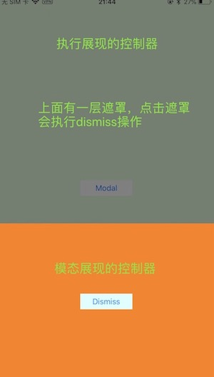

# YSModal
- 方向模态弹框(向上、下、左、右，半屏有遮罩)，常用于操作类弹框
- 中心点淡入淡出弹框



## 使用小技巧

### PresentedViewController 使用说明和示例

1、PresentedViewController只需要继承YSModalPresentedVC即可；

2、默认向上弹框，高度为屏高一半，遮罩颜色为黑色，透明度0.5；

3、如果需要自定义方向、长度，遮罩颜色，透明度，重写以下相应的方法即可；

4、如果是UINavigationController，继承YSModalPresentedNavC，用法一样；

```swift
import UIKit

class PresentedVC: YSModalPresentedVC {

    override func viewDidLoad() {
        super.viewDidLoad()
        view.backgroundColor = UIColor.orange
    }
    
    // 重写此方法，设置Modal类型
    override func setupModalEnum() -> YSModalEnum {
        
        // 默认方向弹框
        return .defaultDirectionModalEnum
        
        // 默认中心点淡入淡出弹框
        return .defaultMiddleCenterFadeInEnum
        
        // 向上弹框
        return .toTop(length: 100, maskViewBackgroundColor: .black, maskViewAlpha: 0.5)
        
        // 向下弹框
        return .toBottom(length: 100, maskViewBackgroundColor: .black, maskViewAlpha: 0.5)
        
        // 向左弹框
        return .toLeft(length: 100, maskViewBackgroundColor: .black, maskViewAlpha: 0.5)
        
        // 向右弹框
        return .toRight(length: 100, maskViewBackgroundColor: .black, maskViewAlpha: 0.5)
        
        // 中心点淡入淡出弹框
        return .middleCenterFadeIn(width: 200, height: 400, maskViewBackgroundColor: .black, maskViewAlpha: 0.5)
    }

    @IBAction func dismissAction(_ sender: UIButton) {
        dismiss(animated: true, completion: nil)
    }
}
```

### PresentingViewController 使用说明及示例

1、在需要Modal展现的地方，直接present即可，注意，presentedVC一定是YSModalPresentedVC或YSModalPresentedNavC的子类对象

```swift
import UIKit

class ViewController: UIViewController{

    override func viewDidLoad() {
        super.viewDidLoad()
    }

    @IBAction func modalAction(_ sender: UIButton) {
        let sb = UIStoryboard(name: "Main", bundle: nil)
        let presentedVC = sb.instantiateViewController(withIdentifier: "p") as! YSModalPresentedVC

        // Modal展现
        present(presentedVC, animated: true, completion: nil)
    }
}
```
